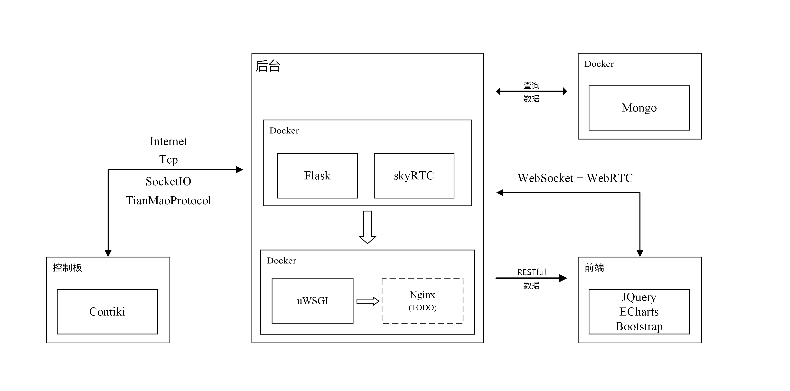

# IoT Sensor Web

A demo flask server for IoT sensor manager. 

See demo on [https://iot.zthxxx.me](https://iot.zthxxx.me)

Platform: Ubuntu 14.04


## Architecture 

```
Docker
  |__ MongoDB
  
Docker
  |__ Flask
  |__ SkyRTC
```



## Install

**! Make sure U have docker**

```bash
$ cd ~/Download
$ wget https://raw.githubusercontent.com/zthxxx/python-flask-IoT_Sensor_Web/feature/IoT_web_docker_init.sh
$ docker run -dit -v /var/database/mongodb:/var/database/mongodb -p 80:80 -p 31511:31511 -p 3000:3000 ubuntu /bin/bash
$ cat IoT_web_docker_init.sh | docker exec -i $(docker ps -q) tee /root/IoT_web_docker_init.sh
$ docker exec $(docker ps -q) chmod +x /root/IoT_web_docker_init.sh
$ docker exec $(docker ps -q) /root/IoT_web_docker_init.sh | docker exec -i $(docker ps -q) tee -a /root/docker_init.log
```


## Start

Then should **EDIT** the config file `flaskr_Configuration.conf` and `ServerConfig.ini`

```bash
$ cp flaskr_Configuration.conf.example flaskr_Configuration.conf
$ cp ServerConfig.ini.example ServerConfig.ini
$ vim flaskr_Configuration.conf
$ vim ServerConfig.ini
$ ./IoT_Web_Server_Restart.sh
```


## License

GPL